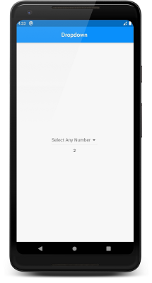
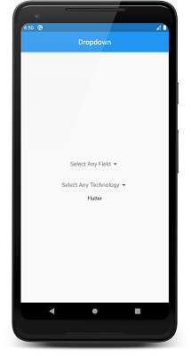

# Dropdown In Flutter

### Watch Tutorial [Here](https://youtu.be/dbcB8d8WlJo).  
### Watch Hindi Tutorial [Here](https://youtu.be/KMRc6LPURbE).

## Workflow

```dart
    DropdownButton<String>(
                items: [
                    // List Of DropdowmMenuItem
                  DropdownMenuItem<String>(
                      // Value Returned
                    value: "Web",
                    // Value Displayed
                    child: Center(
                      child: Text("Web"),
                    ),
                  ),
                ],
                // callback when a value is selected 
                // takes a parameter
                onChanged: (_value) => valuechanged(_value),
                // Hint Displayed Normally
                hint: Text(
                  "Select Your Field.",
                  style: TextStyle(
                    color: Colors.black,
                  ),
                ),
                // Hint Displayed When Dropdown is disabled
                disabledHint: Text("First Select Your Field."),
              ),
```

## To Create A DropDownMenuItems Dynamically

1. Create a list of DropdownMenuItem<String>
```dart
    List<DropdownMenuItem<String>> menuItems = List();
```

2. Create A Map of Values
```dart
    final web = {
    '1': "PHP",
    '2': "Python",
    '3': "Node js",
  };
```

3. Create a function to populate the list
```dart
    void populateweb() {
    for (String key in web.keys) {
      menuItems.add(DropdownMenuItem<String>(
        child: Center(
          child: Text(web[key]),
        ), 
        value: web[key], 
      ));
    }
  }
```

4. Call the items in The DropDownButton
```dart
    items: menuItems,
```

## Working Screenshots
[](https://youtu.be/dbcB8d8WlJo)

[](https://youtu.be/dbcB8d8WlJo)

